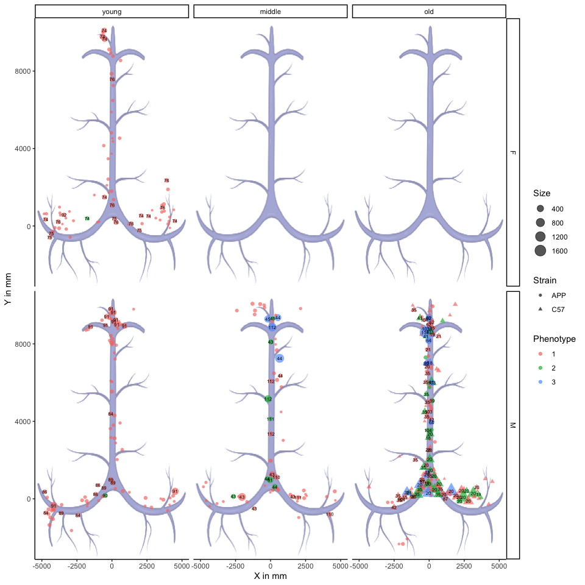
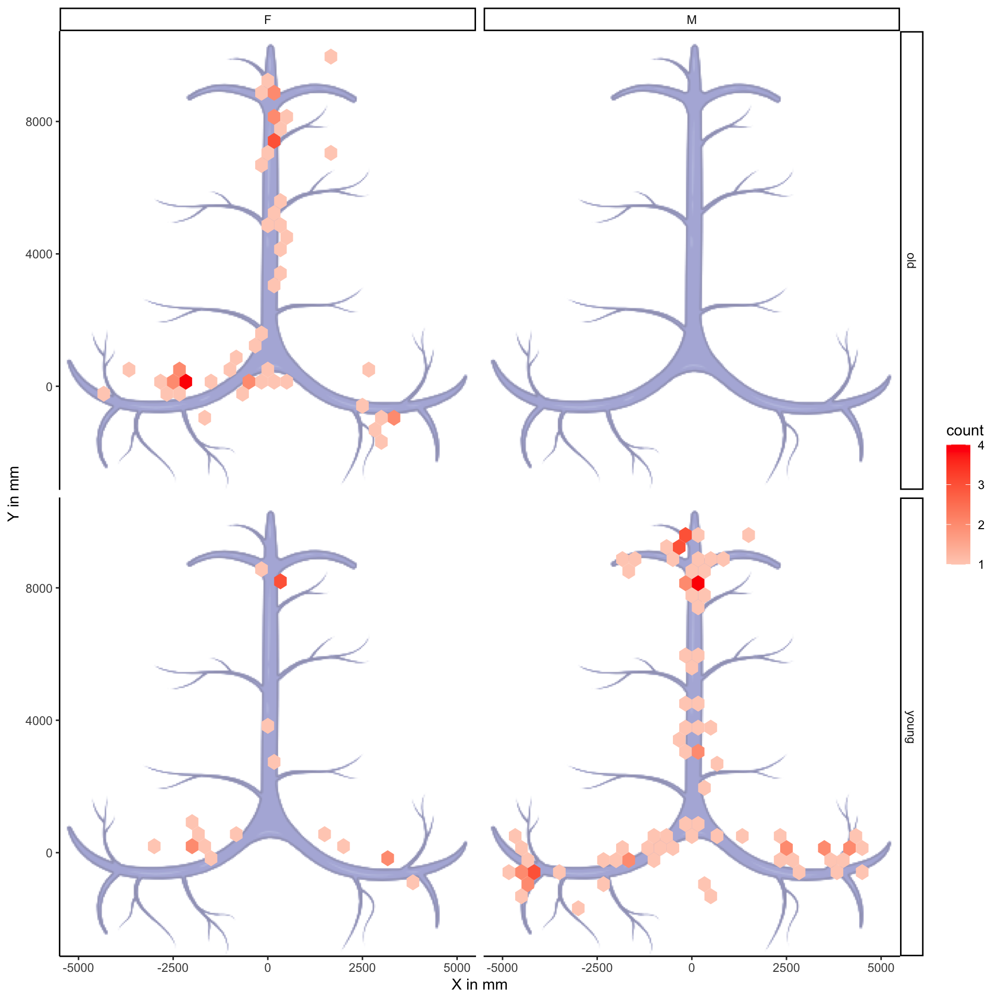
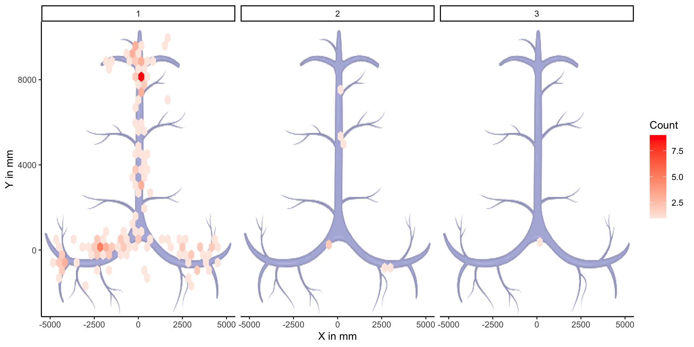
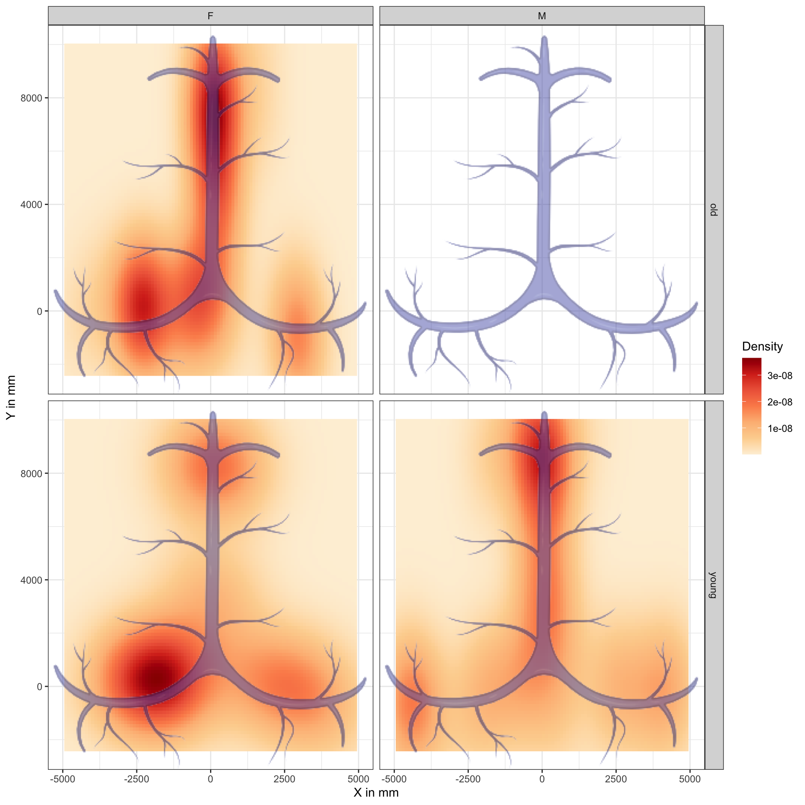
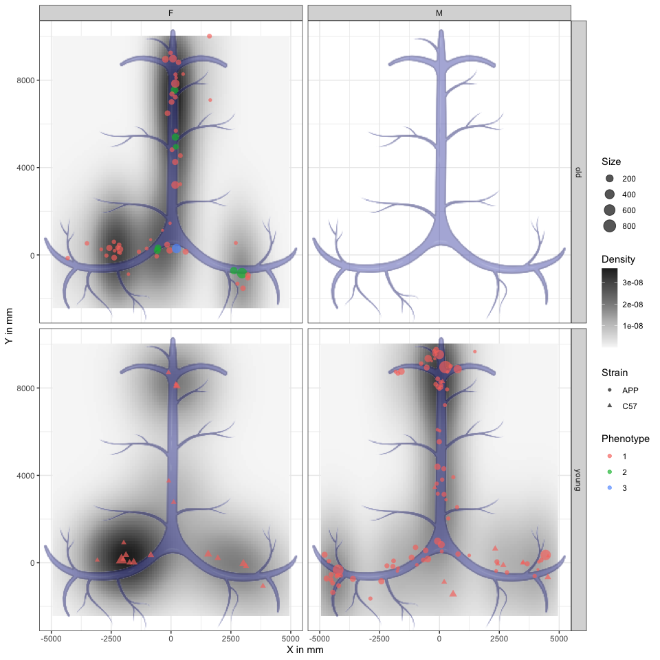
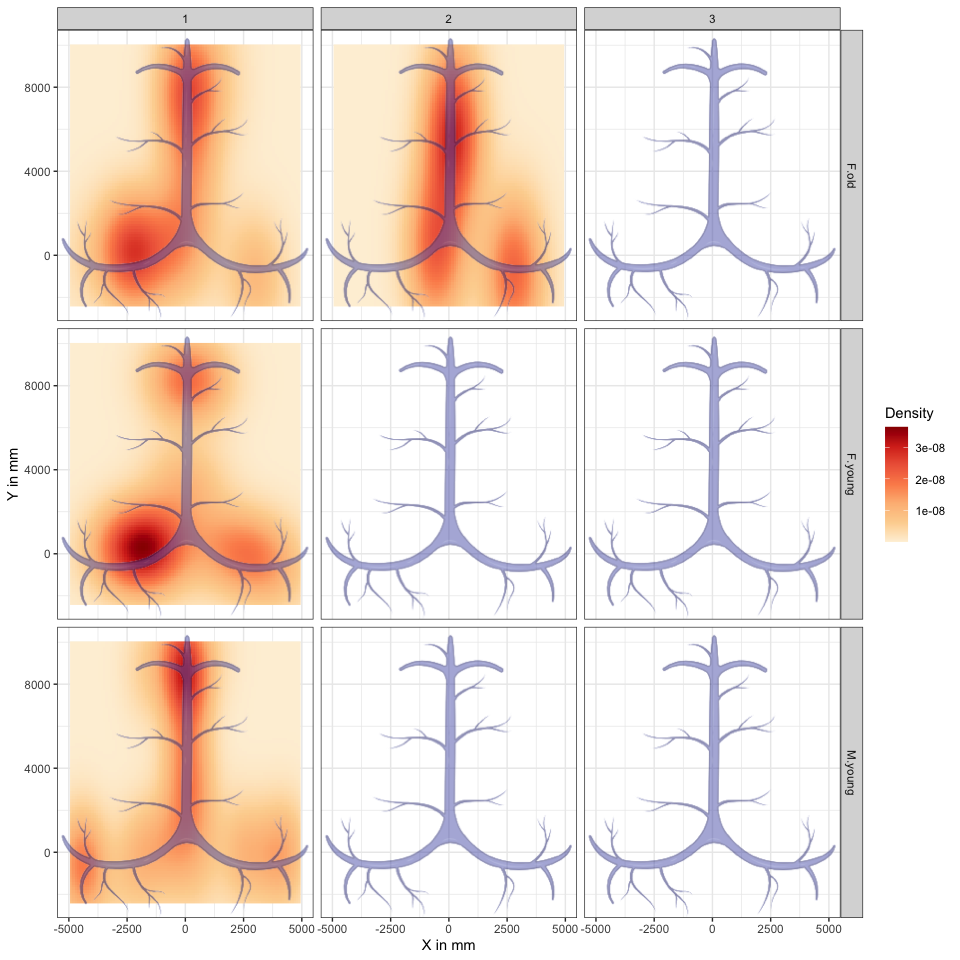

# Meninges Report

-   [Overview](#overview)
-   [Exploratory statistics](#exploratory-statistics)
-   [Location of structures](#location-of-structures)
-   [Distribution of structures](#distribution-of-structures)
    -   [Distribution by phenotype](#distribution-by-phenotype)
-   [Density of structures](#density-of-structures)
    -   [Density by phenotype](#density-by-phenotype)

## Overview

This report is designed to visualise the distribution of Tertiary
Lymphatic Structures (TLSs) in mice meninges in multiple ways that
provide insight to different aspects of the data.

## Exploratory statistics

The current analysis includes data on 165 lymphatic structures from 16
mice, belonging to 2 strains, 2 age categories and 2 genders, for a
total of 4 groups ([Table 1](#tbl-stats)).

<table>
<caption>Table 1: Basic statistics on the TLSs from mice meninges. Size
and length are measured in mm, whereas phenotype and sinus location are
reported in terms of the number of structures per each phenotype or
sinus location, respectively.</caption>
<colgroup>
<col style="width: 4%" />
<col style="width: 6%" />
<col style="width: 7%" />
<col style="width: 5%" />
<col style="width: 12%" />
<col style="width: 10%" />
<col style="width: 12%" />
<col style="width: 20%" />
<col style="width: 19%" />
</colgroup>
<thead>
<tr class="header">
<th style="text-align: left;">Sex</th>
<th style="text-align: left;">Age</th>
<th style="text-align: left;">Strain</th>
<th style="text-align: right;">Mice</th>
<th style="text-align: right;">Structures</th>
<th style="text-align: right;">MeanSize</th>
<th style="text-align: right;">MeanLength</th>
<th style="text-align: left;">Phenotype (1-2-3)</th>
<th style="text-align: left;">Sinus (0-90-180)</th>
</tr>
</thead>
<tbody>
<tr class="odd">
<td style="text-align: left;">F</td>
<td style="text-align: left;">old</td>
<td style="text-align: left;">APP</td>
<td style="text-align: right;">4</td>
<td style="text-align: right;">56</td>
<td style="text-align: right;">113.0</td>
<td style="text-align: right;">40.2</td>
<td style="text-align: left;">48-7-1</td>
<td style="text-align: left;">4-25-27</td>
</tr>
<tr class="even">
<td style="text-align: left;">F</td>
<td style="text-align: left;">young</td>
<td style="text-align: left;">C57</td>
<td style="text-align: right;">3</td>
<td style="text-align: right;">19</td>
<td style="text-align: right;">81.8</td>
<td style="text-align: right;">36.2</td>
<td style="text-align: left;">19-0-0</td>
<td style="text-align: left;">5-6-8</td>
</tr>
<tr class="odd">
<td style="text-align: left;">M</td>
<td style="text-align: left;">young</td>
<td style="text-align: left;">APP</td>
<td style="text-align: right;">5</td>
<td style="text-align: right;">80</td>
<td style="text-align: right;">105.0</td>
<td style="text-align: right;">49.9</td>
<td style="text-align: left;">80-0-0</td>
<td style="text-align: left;">15-47-18</td>
</tr>
<tr class="even">
<td style="text-align: left;">M</td>
<td style="text-align: left;">young</td>
<td style="text-align: left;">C57</td>
<td style="text-align: right;">4</td>
<td style="text-align: right;">10</td>
<td style="text-align: right;">59.6</td>
<td style="text-align: right;">34.3</td>
<td style="text-align: left;">10-0-0</td>
<td style="text-align: left;">6-4-0</td>
</tr>
</tbody>
</table>

Table 1: Basic statistics on the TLSs from mice meninges. Size and
length are measured in mm, whereas phenotype and sinus location are
reported in terms of the number of structures per each phenotype or
sinus location, respectively.

## Location of structures

## Distribution of structures

### Distribution by phenotype

## Density of structures

[Figure 4](#fig-dens) shows the density of TLSs.

### Density by phenotype

