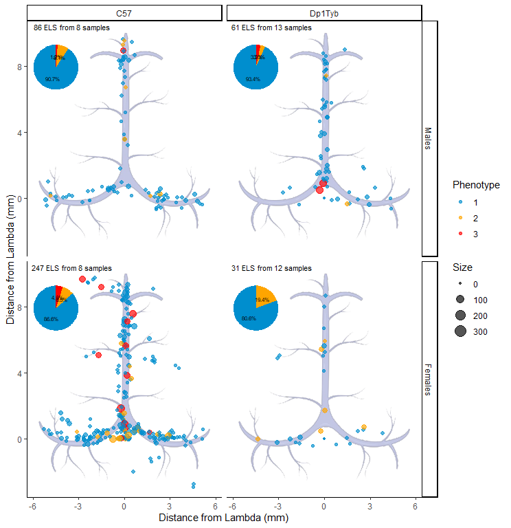

# Between-Strain Analysis

-   [Overview](#overview)
-   [Exploratory statistics](#exploratory-statistics)
-   [Comparison of Distributions](#comparison-of-distributions)

## Overview

In this report we compare the distribution of Tertiary Lymphatic
Structures (TLSs) in the meninges of mice from two different strains:
Dp1Tyb and C57. Only Males and Females at a middle age were taken into
consideration.

## Exploratory statistics

<table>
<caption>Table 1: Basic statistics on the TLSs from mice meninges. Size
and length are measured in mm, whereas phenotype and sinus location are
reported in terms of the number of structures per each phenotype or
sinus location, respectively.</caption>
<colgroup>
<col style="width: 4%" />
<col style="width: 7%" />
<col style="width: 5%" />
<col style="width: 11%" />
<col style="width: 12%" />
<col style="width: 12%" />
<col style="width: 18%" />
<col style="width: 17%" />
<col style="width: 13%" />
</colgroup>
<thead>
<tr class="header">
<th style="text-align: left;">Sex</th>
<th style="text-align: left;">Strain</th>
<th style="text-align: right;">Mice</th>
<th style="text-align: right;">Structures</th>
<th style="text-align: right;">AvgDiameter</th>
<th style="text-align: right;">AvgDistance</th>
<th style="text-align: left;">Phenotype (1-2-3)</th>
<th style="text-align: left;">Sinus (0-90-180)</th>
<th style="text-align: left;">Desc</th>
</tr>
</thead>
<tbody>
<tr class="odd">
<td style="text-align: left;">F</td>
<td style="text-align: left;">C57</td>
<td style="text-align: right;">8</td>
<td style="text-align: right;">247</td>
<td style="text-align: right;">14.6</td>
<td style="text-align: right;">3.6</td>
<td style="text-align: left;">214-21-12</td>
<td style="text-align: left;">60-121-66</td>
<td style="text-align: left;">12 months</td>
</tr>
<tr class="even">
<td style="text-align: left;">F</td>
<td style="text-align: left;">Dp1Tyb</td>
<td style="text-align: right;">12</td>
<td style="text-align: right;">31</td>
<td style="text-align: right;">10.0</td>
<td style="text-align: right;">3.2</td>
<td style="text-align: left;">25-6-0</td>
<td style="text-align: left;">10-13-8</td>
<td style="text-align: left;">10-15 months</td>
</tr>
<tr class="odd">
<td style="text-align: left;">M</td>
<td style="text-align: left;">C57</td>
<td style="text-align: right;">8</td>
<td style="text-align: right;">86</td>
<td style="text-align: right;">8.6</td>
<td style="text-align: right;">4.2</td>
<td style="text-align: left;">78-7-1</td>
<td style="text-align: left;">31-33-22</td>
<td style="text-align: left;">12 months</td>
</tr>
<tr class="even">
<td style="text-align: left;">M</td>
<td style="text-align: left;">Dp1Tyb</td>
<td style="text-align: right;">13</td>
<td style="text-align: right;">61</td>
<td style="text-align: right;">10.2</td>
<td style="text-align: right;">3.9</td>
<td style="text-align: left;">57-2-2</td>
<td style="text-align: left;">15-43-3</td>
<td style="text-align: left;">10-15 months</td>
</tr>
</tbody>
</table>

Table 1: Basic statistics on the TLSs from mice meninges. Size and
length are measured in mm, whereas phenotype and sinus location are
reported in terms of the number of structures per each phenotype or
sinus location, respectively.

## Comparison of Distributions

