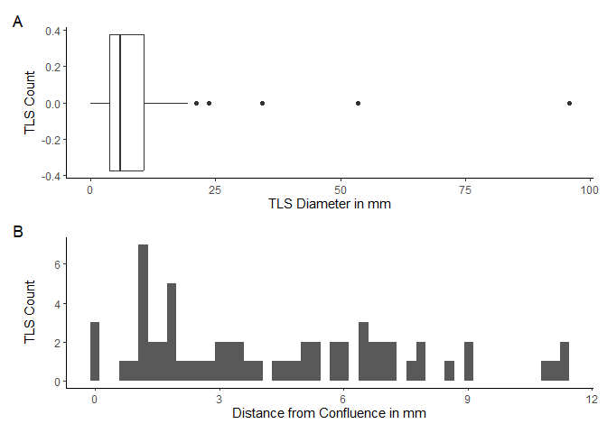
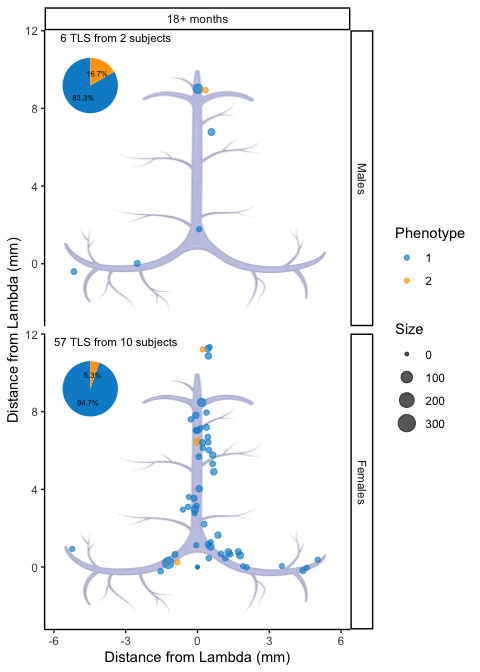
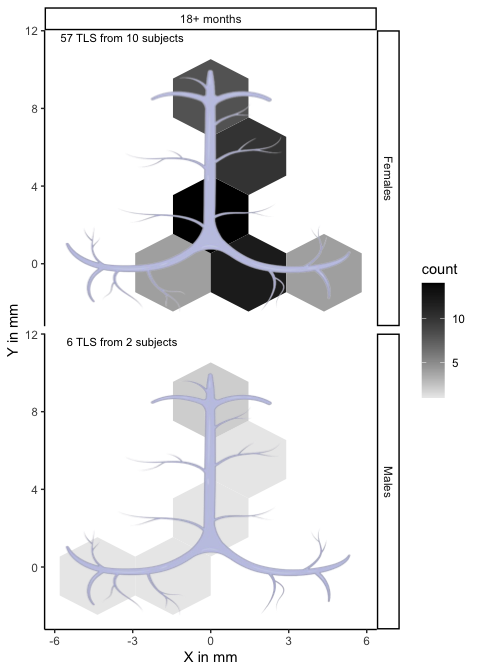
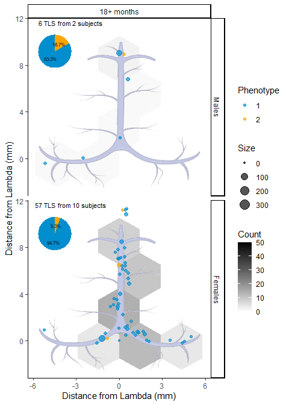

# Whithin-Strain Analysis

-   [Overview](#overview)
-   [Exploratory statistics](#exploratory-statistics)
-   [Distribution of structures](#distribution-of-structures)
-   [Density of structures](#density-of-structures)
-   [Distribution and Density of
    structures](#distribution-and-density-of-structures)
-   [Distribution by phenotype](#distribution-by-phenotype)

## Overview

In this report we profile the meninges of Tau mice in terms of Tertiary
Lymphatic Structures (TLSs). The following chapters provide insight to
different aspects of the TLSs, such as their location, distribution and
density.

## Exploratory statistics

The current analysis includes data on 63 lymphatic structures from 12
mice, belonging to 1 strains, 1 age categories and 2 genders, for a
total of 2 groups ([Table 1](#tbl-stats)).

<table>
<caption>Table 1: Basic statistics on the TLSs from mice meninges. Size
and length are measured in mm, whereas phenotype and sinus location are
reported in terms of the number of structures per each phenotype or
sinus location, respectively.</caption>
<colgroup>
<col style="width: 4%" />
<col style="width: 4%" />
<col style="width: 5%" />
<col style="width: 11%" />
<col style="width: 12%" />
<col style="width: 12%" />
<col style="width: 19%" />
<col style="width: 18%" />
<col style="width: 11%" />
</colgroup>
<thead>
<tr class="header">
<th style="text-align: left;">Sex</th>
<th style="text-align: left;">Age</th>
<th style="text-align: right;">Mice</th>
<th style="text-align: right;">Structures</th>
<th style="text-align: right;">AvgDiameter</th>
<th style="text-align: right;">AvgDistance</th>
<th style="text-align: left;">Phenotype (1-2-3)</th>
<th style="text-align: left;">Sinus (0-90-180)</th>
<th style="text-align: left;">Desc</th>
</tr>
</thead>
<tbody>
<tr class="odd">
<td style="text-align: left;">F</td>
<td style="text-align: left;">old</td>
<td style="text-align: right;">10</td>
<td style="text-align: right;">57</td>
<td style="text-align: right;">9.3</td>
<td style="text-align: right;">4.2</td>
<td style="text-align: left;">54-3-0</td>
<td style="text-align: left;">19-33-5</td>
<td style="text-align: left;">18+ months</td>
</tr>
<tr class="even">
<td style="text-align: left;">M</td>
<td style="text-align: left;">old</td>
<td style="text-align: right;">2</td>
<td style="text-align: right;">6</td>
<td style="text-align: right;">15.9</td>
<td style="text-align: right;">5.7</td>
<td style="text-align: left;">5-1-0</td>
<td style="text-align: left;">0-4-2</td>
<td style="text-align: left;">18+ months</td>
</tr>
</tbody>
</table>

Table 1: Basic statistics on the TLSs from mice meninges. Size and
length are measured in mm, whereas phenotype and sinus location are
reported in terms of the number of structures per each phenotype or
sinus location, respectively.

[Figure 1](#fig-bar) shows the distribution the TLSs distribute in terms
of their length and size across all tissues.

## Distribution of structures

## Density of structures

## Distribution and Density of structures

## Distribution by phenotype

